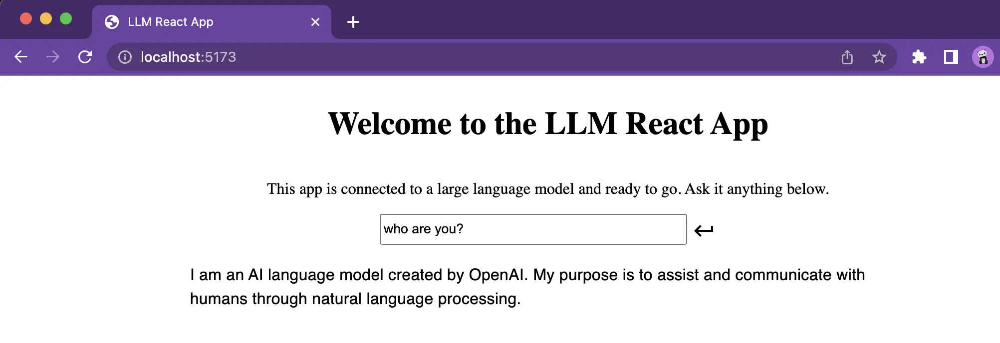

<h1 align='center' >
LLM React App Javascript Template 🪐
</h1>
<p align='center'>
    <a href='https://github.com/golivecosmos/pluto/blob/main/LICENSE'>
        
    </a>
    <a href='https://github.com/golivecosmos/llm-react-node-app-template'>
        
    </a>
     <a href='https://twitter.com/golivecosmos'>
       
     </a>
</p>

## What is this template?

This template is an example project for a simple Large Language Model (LLM) application built on top of React and Node. This template was built on top of [the React template app from nano-react-app](https://github.com/nano-react-app/template-js) and updated with a Node server that uses [HuggingFace.js](https://github.com/huggingface/huggingface.js) and [LangChain.js](https://github.com/hwchase17/langchainjs) to connect to supported large language models. Use this template to easily build and run an LLM app, like the screenshot below:



## Getting Started

To get started, follow the below steps:

1. Create an `.env` file by copying the `SAMPLE_env` file and add the model store provider you'll be using (e.g. `HUGGING_FACE` or `OPEN_AI`) and the API keys for the models you are going to use
1. Install packages
1. Run the backend server that will start with a default port of `3100`

    ```bash
        yarn start-server
    ```

1. Run the frontend server that will start with a default port of `5173`.

     ```bash
        yarn start
    ```

    _Note:_ You can use the `-p` flag to specify a port for the frontend server. To do this, you can either run `yarn start` with an additional flag, like so:

    ```bash
        yarn start -- --port 3000
    ```

    Or, edit the `start` script directly:

    ```bash
    vite --port 3000
    ```

Additional scripts are provided to prepare the app for production

- `yarn build` — This will output a production build of the frontend app in the `dist` directory.
- `yarn preview` — This will run the production build of the frontend app locally with a default port of `5173` (_note_: this will not work if you haven't generated the production build yet).

### Tutorials

👽 Looking for more content? Check out [our tutorials on running LLM apps](https://blog.golivecosmos.com/posts/) 📚

-------------

## How to Contribute

Feel free to try out the template and open any issues if there's something you'd like to see added or fixed, or open a pull request to contribute.

#### Shout out to the ⭐star gazers⭐

[](https://github.com/golivecosmos/llm-react-node-app-template/stargazers)

#### Thanks for the forks🍴

[](https://github.com/golivecosmos/llm-react-node-app-template/network/members)
